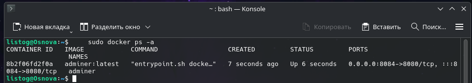
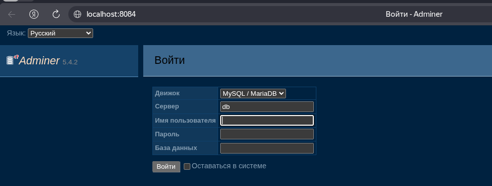

# Развертывание панели Adminer через Docker

Данное руководство описывает процесс быстрого запуска легковесного инструмента Adminer. Эта панель предназначена для удобного управления базами данных через веб-интерфейс без необходимости устанавливать локальные клиенты.

## 1. Предварительная проверка
Перед началом работы удостоверьтесь, что служба Docker установлена в вашей системе (Debian Linux) и функционирует корректно. Проверить это можно командой:

    sudo docker --version

## 2. Инициализация контейнера
Для работы мы будем использовать официальный образ Adminer. Чтобы загрузить и запустить контейнер, выполните команду:

    sudo docker run -d \
      --name adminer \
      -p 8084:8080 \
      adminer:latest

**Расшифровка аргументов запуска:**
* -d — отсоединяет процесс от консоли (фоновый режим работы).
* --name adminer — присваивает контейнеру удобное для обращения имя.
* -p 8084:8080 — пробрасывает порт хоста (8084) на стандартный HTTP-порт Adminer внутри контейнера (8080).

## 3. Мониторинг состояния
После выполнения команды убедитесь, что контейнер успешно стартовал:

    sudo docker ps -a

В выведенной таблице должен отображаться контейнер adminer со статусом Up. 

## 4. Доступ к интерфейсу
Откройте любой веб-браузер и перейдите по адресу:

    http://localhost:8084

На стартовой странице Adminer вам потребуется выбрать тип СУБД (например, MySQL или PostgreSQL) и ввести реквизиты доступа к вашей базе данных (адрес сервера, логин и пароль), которую вы планируете администрировать.

## 5. Базовые команды управления
Для дальнейшего администрирования вам пригодятся эти команды:

* Остановка панели:
    sudo docker stop adminer

* Повторный запуск:
    sudo docker start adminer

* Полное удаление контейнера:
    sudo docker rm -f adminer
