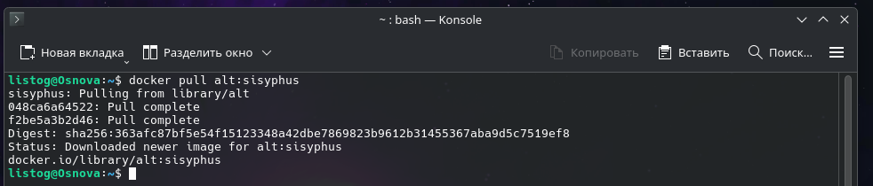
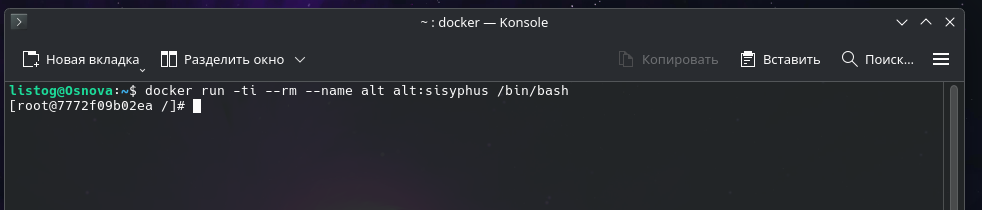
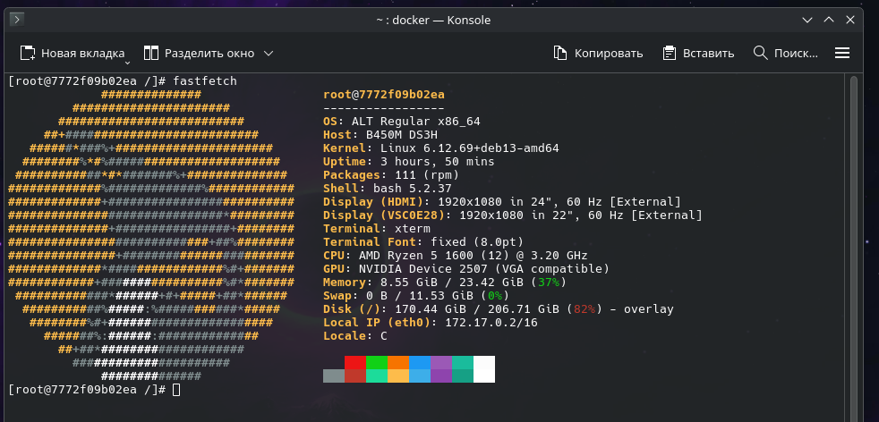

# Использование Alt Linux в Docker

Данное руководство описывает процесс загрузки и запуска контейнера на базе операционной системы Alt Linux (ветка разработчиков Sisyphus). Мы развернем временную среду, установим системную утилиту и проверим ее работу.

> **Важно:** Никогда в разработке не используйте русские имена файлов и каталогов!
> Никогда не используйте пробелы и спецсимволы в именах файлов и каталогов!

## 1. Загрузка готового образа Alt Linux
Для начала работы необходимо скачать официальный образ Alt Linux из реестра Docker Hub. Выполните команду:

    docker pull alt:sisyphus

Эта команда загрузит необходимые слои файловой системы на ваш локальный компьютер.

## 2. Запуск и вход в контейнер
После успешной загрузки образа запустите контейнер в интерактивном режиме с привязкой к вашему терминалу:

    docker run -ti --rm --name alt alt:sisyphus /bin/bash

**Расшифровка аргументов запуска:**
* `-ti` — связка флагов для запуска контейнера в интерактивном режиме и привязки ввода-вывода к терминалу.
* `--rm` — приказывает Docker автоматически удалить контейнер сразу после завершения сеанса.
* `--name alt` — задает контейнеру короткое и понятное имя.
* `alt:sisyphus` — указывает нужный образ и его тег.
* `/bin/bash` — запускает командную оболочку Bash внутри контейнера.

Как только команда выполнится, приглашение командной строки изменится — теперь вы находитесь внутри среды Alt Linux.

## 3. Установка утилиты Fastfetch
Находясь внутри контейнера, давайте обновим индексы репозиториев и установим утилиту `fastfetch` (современный, быстрый аналог neofetch):

    apt-get update && apt-get install fastfetch

*Примечание: Alt Linux использует собственный порт пакетного менеджера APT (APT-RPM), поэтому синтаксис команд вам уже знаком по Debian.*

## 4. Запуск Fastfetch
После успешной установки пакета, запустите утилиту:

    fastfetch

Утилита выведет в консоль логотип Alt Linux и основную информацию о системе, которая сейчас работает внутри вашего изолированного контейнера.

## 5. Завершение работы
Поскольку при запуске мы передали флаг `--rm`, вам не нужно вручную очищать систему от остановленного контейнера. Для выхода просто введите:

    exit

Сеанс Bash завершится, вы вернетесь в свой родной терминал Debian, а временный контейнер `alt` будет мгновенно и безвозвратно удален.

---

### Полезные ссылки
Для более глубокого изучения работы с Alt Linux в Docker вы можете обратиться к официальным материалам:
* [alt Docker Official Image](https://hub.docker.com/_/alt/)
* [Dockerfile (пример сборки)](https://github.com/alt-cloud/docker-brew-alt/blob/p10/x86_64/Dockerfile)
* [Docker Alt Linux Image (документация)](https://github.com/sibsau/docker-alt/blob/master/README.md)
