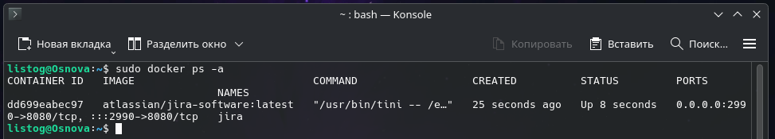
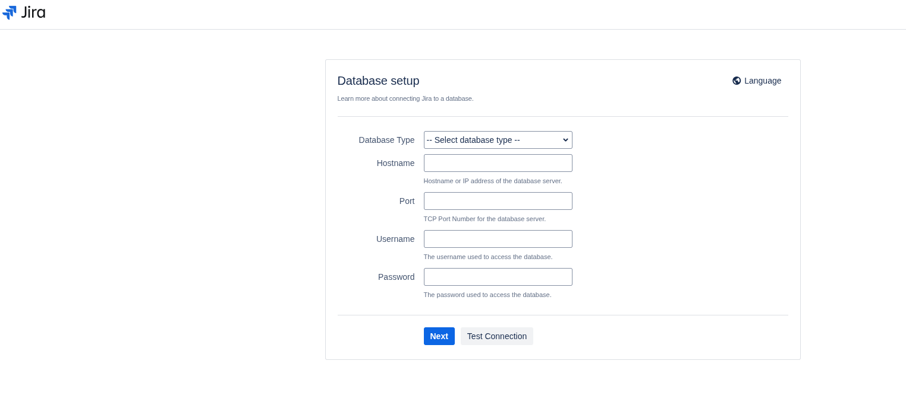

# Развертывание платформы Jira через Docker

Данное руководство описывает процесс развертывания Jira — мощной платформы обратной связи, отслеживания задач и коммуникации, которая является важной частью инструментария DevOps.

## 1. Предварительная проверка
Перед началом работы удостоверьтесь, что служба Docker установлена в вашей системе и функционирует корректно. Проверить это можно командой:

    sudo docker --version

## 2. Инициализация контейнера
Для развертывания Jira мы загрузим образ, создадим и запустим контейнер. Выполните следующую команду:

    sudo docker run -d \
      --name jira \
      -p 2990:8080 \
      atlassian/jira-software:latest

> **Примечание:** В качестве альтернативы можно использовать образ `addono/jira-software-standalone`.

**Расшифровка аргументов запуска:**
* `-d` — отсоединяет процесс от консоли (фоновый режим работы).
* `--name jira` — присваивает контейнеру удобное и понятное имя.
* `-p 2990:8080` — пробрасывает порт 8080 из контейнера на порт 2990 вашего хоста для доступа к веб-интерфейсу.
* `atlassian/jira-software:latest` — указывает Docker скачать (если его нет локально) и использовать самую актуальную официальную версию образа Jira.

## 3. Мониторинг состояния и логирование
Убедитесь, что контейнер успешно стартовал:

    sudo docker ps -a

В выведенной таблице должен отображаться контейнер `jira` со статусом Up. 

Поскольку образ при первом запуске долго инициализируется (до 5-10 минут), рекомендуется запустить просмотр логов для наблюдения за процессом подготовки приложения:

    sudo docker logs -f jira

В терминале будет виден процесс распаковки и настройки компонентов Jira. Для выхода из режима просмотра логов нажмите `Ctrl+C`.

## 4. Доступ к интерфейсу
Приложение, запущенное в контейнере, может готовиться долго, поэтому в браузере вы не сразу увидите результат. По завершении инициализации в логах откройте любой веб-браузер и перейдите по адресу:

    http://localhost:2990/

> **Важно:** Для выполнения текущего задания **заполнять данные админ-панели не нужно!** Достаточно убедиться, что стартовая страница успешно загрузилась.

## 5. Основные возможности Jira
После полноценной настройки Jira предоставляет обширный функционал для управления проектами и DevOps-процессами:

* **Управление задачами (Issue Tracking):** Создание баг-репортов, пользовательских историй (User Stories) и эпиков.
* **Agile-инструменты:** Поддержка Scrum и Kanban досок для гибкой разработки.
* **Кастомизация рабочих процессов (Workflows):** Настройка уникальных статусов и переходов под нужды конкретной команды.
* **Интеграция:** Глубокая связь с другими инструментами DevOps (Bitbucket, Confluence, Jenkins, GitLab и др.).
* **Отчетность:** Построение графиков сгорания (Burndown charts), отчетов по спринтам и скорости команды.

## 6. Базовые команды управления
Для ручного управления контейнером через терминал используйте следующие команды:

* Остановка сервера Jira:
    sudo docker stop jira

* Повторный запуск:
    sudo docker start jira

* Полное удаление контейнера:
    sudo docker rm -f jira
