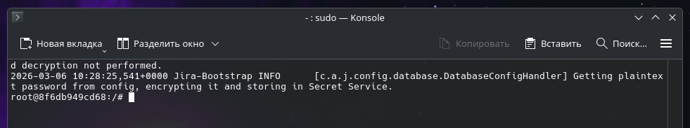
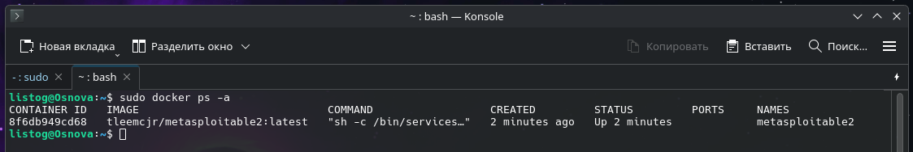
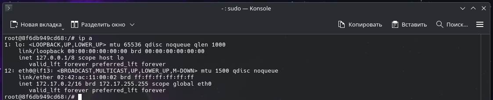

# Развертывание уязвимой среды Metasploitable2 через Docker

Данное руководство описывает процесс развертывания Metasploitable2 — специально уязвимой виртуальной машины Linux, созданной проектом Metasploit. Она предназначена для использования в качестве безопасной среды обучения и тестирования, где специалисты и энтузиасты в области информационной безопасности могут практиковать навыки взлома и пентеста.

## 1. Предварительная проверка
Перед началом работы удостоверьтесь, что служба Docker установлена в вашей системе и функционирует корректно. Проверить это можно командой:

```shell
sudo docker --version
```

## 2. Загрузка образа и инициализация контейнера
Для развертывания среды мы сначала загрузим образ, а затем запустим его в интерактивном режиме. 

Шаг 1. Скачайте образ из Docker Hub:

```shell
sudo docker pull tleemcjr/metasploitable2
```

Шаг 2. Создайте и запустите контейнер с запуском уязвимых сервисов:

```shell
sudo docker run --name metasploitable2 -it tleemcjr/metasploitable2:latest sh -c "/bin/services.sh && bash"
```



**Расшифровка аргументов запуска:**
* `--name metasploitable2` — присваивает контейнеру удобное имя для дальнейшего управления.
* `-it` — запускает контейнер в интерактивном режиме (interactive) с привязкой терминала (tty), что позволяет вводить команды внутри контейнера.
* `tleemcjr/metasploitable2:latest` — указывает Docker использовать скачанный образ уязвимой системы.
* `sh -c "/bin/services.sh && bash"` — сначала запускает скрипт старта всех уязвимых сетевых служб внутри контейнера, а затем открывает командную оболочку `bash` для взаимодействия с системой.

## 3. Мониторинг состояния
Чтобы убедиться, что контейнер успешно стартовал, откройте **новую вкладку терминала** (так как в текущей у вас открыта оболочка контейнера) и выполните:

```shell
sudo docker ps -a
```



В выведенной таблице должен отображаться контейнер `metasploitable2` со статусом Up. 

## 4. Доступ к интерфейсу командной строки
В отличие от инструментов с графическим веб-интерфейсом, Metasploitable2 управляется и исследуется через терминал или по сети. После выполнения команды `docker run` в пункте 2, вы автоматически окажетесь внутри командной оболочки (`bash`) запущенного контейнера с правами пользователя root.



Вы можете проверить IP-адрес контейнера (команда `ifconfig` или `ip a`), чтобы в дальнейшем сканировать его из другой системы с помощью Nmap или атаковать через Metasploit Framework.

## 5. Основные возможности и сценарии использования
Metasploitable2 предоставляет широкие возможности для изучения кибербезопасности:

* **Среда для сканирования:** Идеальная мишень для отработки навыков работы с сетевыми сканерами (Nmap, Nessus, OpenVAS).
* **Практика эксплуатации уязвимостей:** Содержит множество устаревших сервисов с известными уязвимостями (CVE) для тренировки в Metasploit Framework.
* **Изучение веб-уязвимостей:** Внутри запущены уязвимые веб-приложения (например, Mutillidae, DVWA) для практики SQL-инъекций, XSS и других атак из списка OWASP Top 10.
* **Анализ конфигураций:** Позволяет изучать примеры слабой настройки прав доступа, слабых паролей и некорректно настроенных сервисов (FTP, SSH, Samba, базы данных).
* **Изолированная лаборатория:** Позволяет безопасно проводить эксперименты без риска навредить реальным рабочим системам (при условии, что порты контейнера не проброшены в публичную сеть).

## 6. Базовые команды управления
Для управления жизненным циклом этого контейнера используйте следующие команды:

Остановка контейнера и выход из интерактивного режима (вводится внутри терминала контейнера):

```shell
exit
```

Полное удаление контейнера (освобождает имя):

```shell
sudo docker rm metasploitable2
```

Удаление скачанного образа (освобождает место на диске):

```shell
sudo docker rmi tleemcjr/metasploitable2
```
