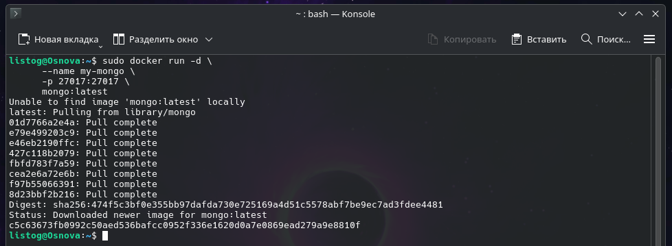
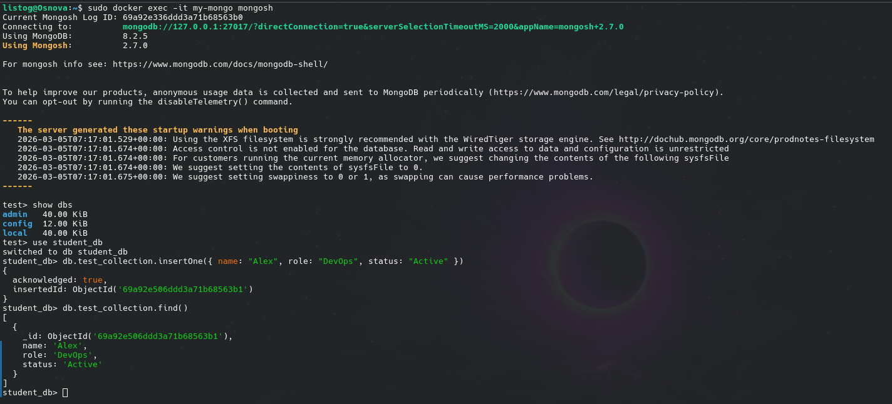

# Работа с NoSQL базами данных: Развертывание MongoDB в Docker

В данном руководстве описывается процесс локального запуска документоориентированной СУБД MongoDB с использованием контейнеризации, а также подключение к ней через современную интерактивную оболочку mongosh.

> 💡 **Напоминание о стандартах:** При организации структуры папок и файлов проекта строго запрещено использование кириллицы, спецсимволов и пробелов. Нарушение этого правила часто приводит к критическим ошибкам при сборке и маршрутизации.

## 1. Запуск контейнера MongoDB
Для того чтобы загрузить актуальную версию образа и запустить сервер БД в фоновом режиме, выполните следующую команду:

    sudo docker run -d \
      --name my-mongo \
      -p 27017:27017 \
      mongo:latest

**Описание используемых флагов:**
* -d — запуск процесса в фоне (detached mode), чтобы терминал остался свободен.
* --name my-mongo — назначение контейнеру удобочитаемого идентификатора.
* -p 27017:27017 — проброс стандартного сетевого порта MongoDB с хост-машины внутрь изолированной среды контейнера.

## 2. Подключение к СУБД через mongosh
Начиная с новых версий MongoDB, для администрирования используется оболочка `mongosh` (взамен устаревшей `mongo`). Чтобы пробросить терминальную сессию внутрь запущенного контейнера и открыть эту оболочку, введите:

    sudo docker exec -it my-mongo mongosh

## 3. Проверка работоспособности (CRUD-операции)
Оказавшись внутри оболочки (приглашение ввода изменится на `test>`), выполните несколько базовых команд для тестирования записи и чтения:

Просмотр списка существующих баз данных (по умолчанию там будут служебные БД):
    show dbs

Создание новой базы данных (или переключение на нее, если она уже существует):
    use student_db

Добавление одной записи (документа) в коллекцию (аналог таблицы) с именем `test_collection`:
    db.test_collection.insertOne({ name: "Alex", role: "DevOps", status: "Active" })

Чтение и вывод всех документов из созданной коллекции:
    db.test_collection.find()

Для корректного завершения сеанса и выхода из оболочки mongosh используйте команду:
    exit
