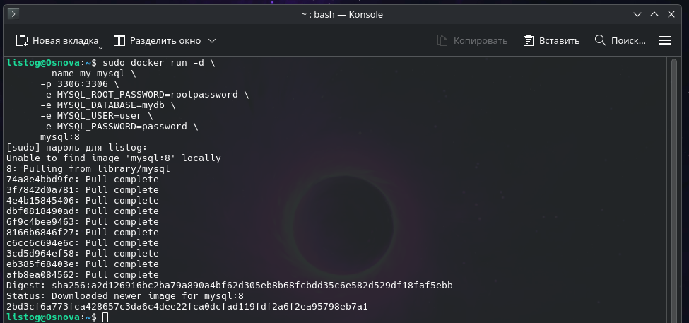
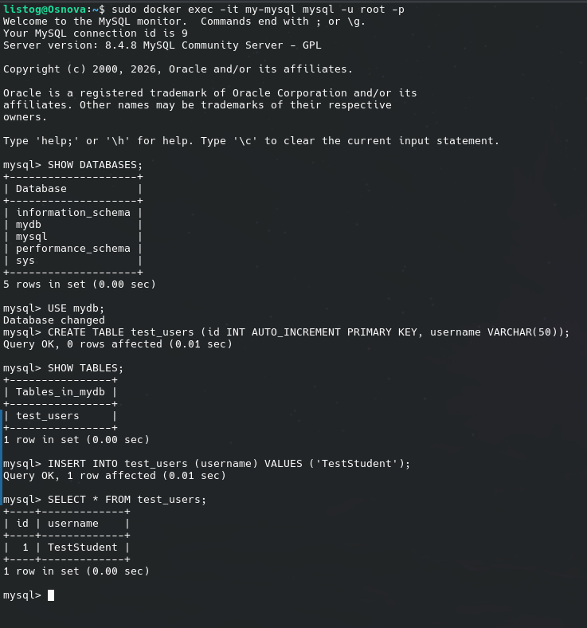

# Развертывание СУБД MySQL в Docker и выполнение базовых запросов

В данной практической работе рассматривается запуск контейнера с базой данных MySQL (версия 8) и подключение к ней через встроенный консольный клиент. 

> 💡 **Важное правило разработки:** При создании структуры локального проекта категорически запрещается использовать кириллицу, пробелы и спецсимволы в названиях директорий и файлов. Используйте только латиницу, цифры, дефисы или нижние подчеркивания.

## 1. Запуск контейнера с MySQL
Для инициализации и старта контейнера с предустановленными параметрами окружения (пароли, пользователи, стартовая база) выполните в терминале следующую команду:

    sudo docker run -d \
      --name my-mysql \
      -p 3306:3306 \
      -e MYSQL_ROOT_PASSWORD=rootpassword \
      -e MYSQL_DATABASE=mydb \
      -e MYSQL_USER=user \
      -e MYSQL_PASSWORD=password \
      mysql:8

**Разбор конфигурации:**
* -e MYSQL_ROOT_PASSWORD — устанавливает пароль для суперпользователя (root).
* -e MYSQL_DATABASE — автоматически генерирует пустую БД с указанным именем при инициализации.
* -e MYSQL_USER и MYSQL_PASSWORD — создают обычного пользователя и дают ему полные права на созданную БД (mydb).

## 2. Интерактивное подключение к БД

[Image of MySQL client-server architecture]

Чтобы провалиться внутрь запущенного контейнера и открыть консольный клиент MySQL от имени суперпользователя, используйте команду `exec`:

    sudo docker exec -it my-mysql mysql -u root -p

После ввода команды система попросит ввести пароль. Напечатайте `rootpassword` и нажмите Enter (в целях безопасности символы при вводе отображаться не будут).

## 3. Выполнение проверочных SQL-запросов
Как только вы успешно авторизуетесь, приглашение командной строки изменится на `mysql>`. Выполните по очереди следующие команды, чтобы проверить работоспособность сервера:

Посмотрим список всех доступных баз данных:
    SHOW DATABASES;

Выберем для работы нашу базу `mydb`, которая создалась автоматически:
    USE mydb;

Создадим тестовую таблицу для проверки прав на запись:
    CREATE TABLE test_users (id INT AUTO_INCREMENT PRIMARY KEY, username VARCHAR(50));

Убедимся, что таблица появилась в базе:
    SHOW TABLES;

Вставим одну запись для проверки:
    INSERT INTO test_users (username) VALUES ('TestStudent');

Посмотрим содержимое таблицы:
    SELECT * FROM test_users;

Чтобы завершить сеанс и выйти из клиента MySQL обратно в терминал Debian, введите:
    exit
