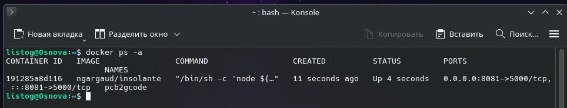
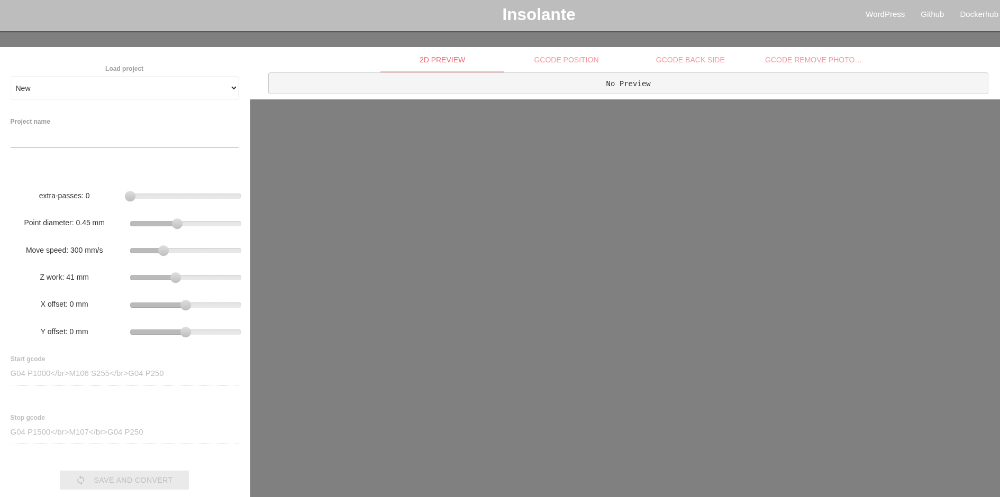

# Развертывание веб-оболочки Pcb2gcode через Docker

Данное руководство описывает процесс запуска оболочки для веб-приложения **Pcb2gcode**. Этот инструмент позволяет создавать проекты и конвертировать файлы Gerber в G-код (например, для гравировки печатных плат на 3D-принтере с УФ-лазером). 

> **Важно:** Никогда в разработке не используйте русские имена файлов и каталогов, а также пробелы и спецсимволы в их названиях!

## 1. Предварительная проверка
Убедитесь, что служба Docker установлена в вашей системе и работает корректно. Проверить это можно следующей командой:

    docker --version

## 2. Подготовка и инициализация контейнера
Для работы необходимо создать локальную папку для хранения данных проекта, а затем запустить контейнер из официального образа `ngargaud/insolante`. 

Действия немного отличаются в зависимости от вашей операционной системы.

Создайте директорию для данных и запустите контейнер:

    mkdir -p ~/insolante_data

    docker run -d \
      --name pcb2gcode \
      -p 8081:5000 \
      -e URL=http://localhost \
      -e RPORT=8180 \
      -e DEBUG=false \
      -v ~/insolante_data:/opt/core/data \
      ngargaud/insolante

**Расшифровка аргументов запуска:**
* `-d` — отсоединяет процесс от консоли (фоновый режим).
* `--name pcb2gcode` — задает контейнеру удобное имя.
* `-p 8081:5000` (или `8080:5000`) — пробрасывает порт хоста на внутренний порт приложения.
* `-e` — задает переменные окружения (URL, порт, режим отладки).
* `-v` — монтирует локальную папку в контейнер, чтобы ваши проекты не удалились при остановке контейнера.

## 3. Мониторинг состояния
После запуска убедитесь, что контейнер успешно работает:

    docker ps -a

В таблице должен появиться контейнер с именем `pcb2gcode` и статусом `Up`.

## 4. Доступ к интерфейсу и настройка
Откройте браузер и перейдите по адресу:
* http://localhost:8081

**Первый вход:**
При первом открытии придумайте и введите простой пароль (например, `123`), чтобы войти в админ-панель проекта.

**Основные вкладки интерфейса:**
* **Положение g-кода:** скрипт для перемещения головки вдоль границ платы (помогает выровнять заготовку).
* **Обратная сторона g-кода:** основной результат работы конвертера `pcb2gcode`.
* **Удаление g-кода:** скрипт для перемещения головки для очистки остатков смолы.

## 5. Базовые команды управления
Для управления запущенным контейнером используйте следующие команды:

* Остановка приложения:
    docker stop pcb2gcode

* Повторный запуск:
    docker start pcb2gcode

* Полное удаление контейнера (данные проектов сохранятся в локальной папке `insolante_data`):
    docker rm -f pcb2gcode
