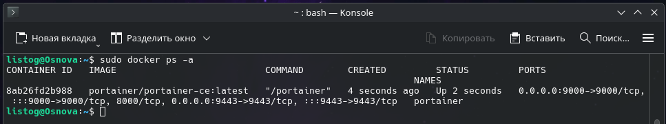
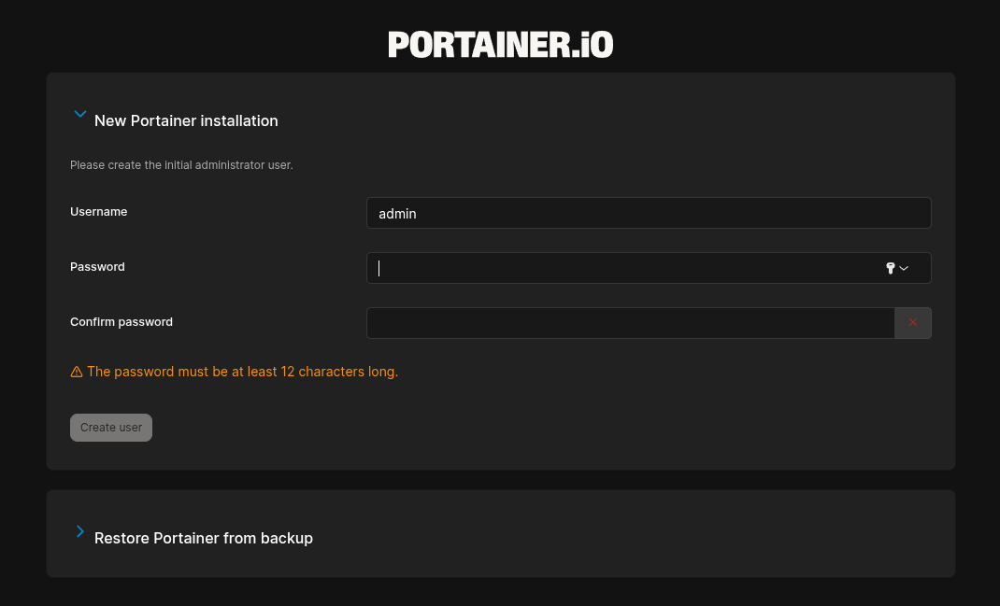

# Развертывание системы управления Portainer через Docker

Данное руководство описывает процесс развертывания Portainer — мощного инструмента с графическим веб-интерфейсом для удобного управления Docker-окружением.

## 1. Предварительная проверка
Перед началом работы удостоверьтесь, что служба Docker установлена в вашей системе и функционирует корректно. Проверить это можно командой:

    sudo docker --version

## 2. Инициализация контейнера (с сохранением данных)
Для развертывания Portainer мы будем использовать официальный образ. Выполните следующую команду, чтобы создать тома для данных и запустить контейнер:

    sudo docker run -d \
      --name portainer \
      -p 9000:9000 \
      -p 9443:9443 \
      -v /var/run/docker.sock:/var/run/docker.sock \
      -v portainer_data:/data \
      --restart unless-stopped \
      portainer/portainer-ce:latest

**Расшифровка аргументов запуска:**
* -d — отсоединяет процесс от консоли (фоновый режим работы).
* --name portainer — присваивает контейнеру удобное имя.
* -p 9000:9000 и -p 9443:9443 — пробрасывают порты для доступа к веб-интерфейсу по HTTP и HTTPS.
* -v /var/run/docker.sock... — пробрасывает сокет Docker, давая Portainer права на управление контейнерами хоста.
* -v portainer_data:/data — монтирует именованный том для безопасного сохранения настроек самого Portainer.
* --restart unless-stopped — указывает Docker автоматически перезапускать контейнер (например, после перезагрузки сервера), если он не был остановлен вручную.

## 3. Мониторинг состояния
Убедитесь, что контейнер успешно стартовал:

    sudo docker ps -a

В выведенной таблице должен отображаться контейнер portainer со статусом Up. 

## 4. Доступ к интерфейсу
Откройте любой веб-браузер и перейдите по адресу:

    http://localhost:9000/

При первом входе система предложит создать учетную запись администратора. Задайте надежный пароль для дальнейшей работы.

## 5. Основные возможности Portainer
После авторизации вам будет доступен широкий функционал для администрирования через удобный графический интерфейс:

* **Dashboard (Главная панель):**
    * Обзор всех контейнеров, образов, сетей и томов.
    * Мониторинг использования ресурсов (CPU, RAM, диски, сетевой трафик).
* **Управление контейнерами:**
    * Создание, удаление, остановка и перезапуск.
    * Просмотр логов в реальном времени и доступ к терминалу внутри контейнера.
    * Копирование файлов в/из контейнера, просмотр статистики.
    * Экспорт и импорт контейнеров.
* **Образы (Images):** Просмотр, удаление, сборка из Dockerfile и загрузка (Pull) новых образов из Docker Hub.
* **Сети (Networks):** Создание пользовательских сетей, просмотр топологии и управление подключениями.
* **Тома (Volumes):** Создание, удаление, резервное копирование и просмотр содержимого томов.
* **Стеки (Stacks):** Развёртывание Docker Compose файлов и управление сразу несколькими связанными сервисами.

## 6. Базовые команды управления
Для ручного управления контейнером через терминал используйте команды:

* Остановка панели:
    sudo docker stop portainer

* Повторный запуск:
    sudo docker start portainer

* Полное удаление контейнера:
    sudo docker rm -f portainer
