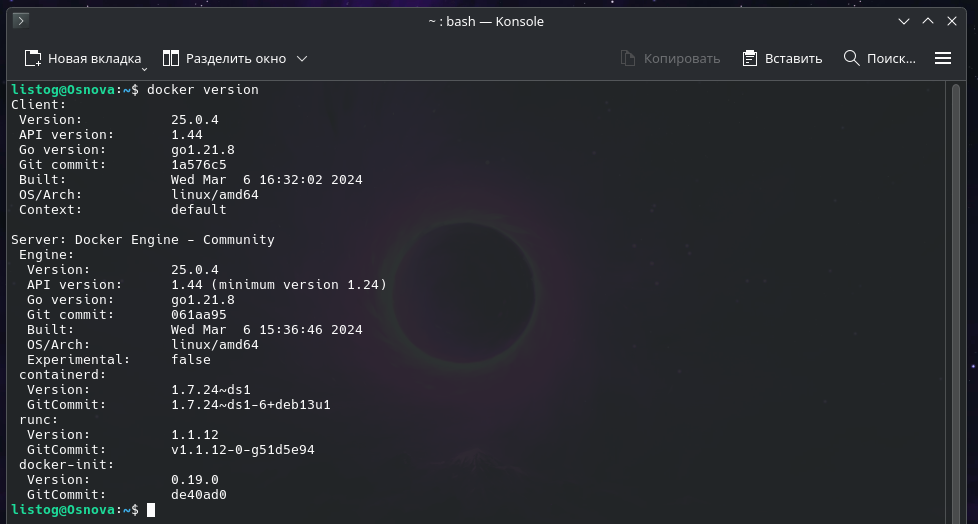
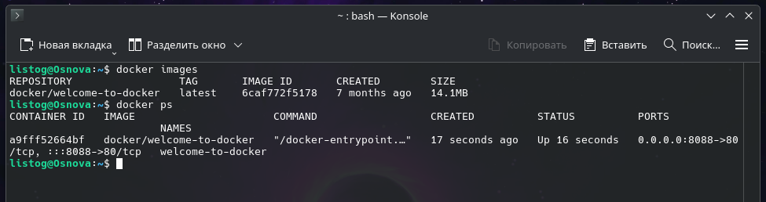
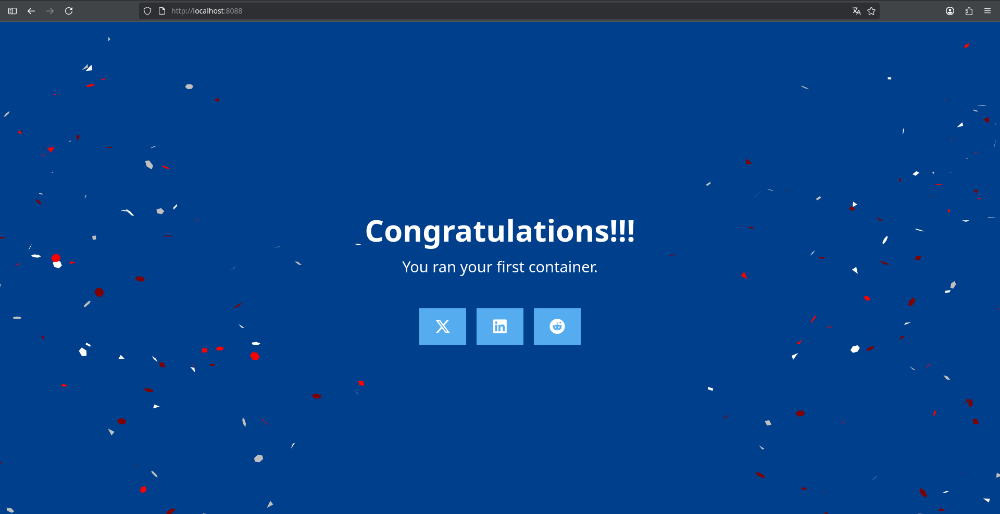
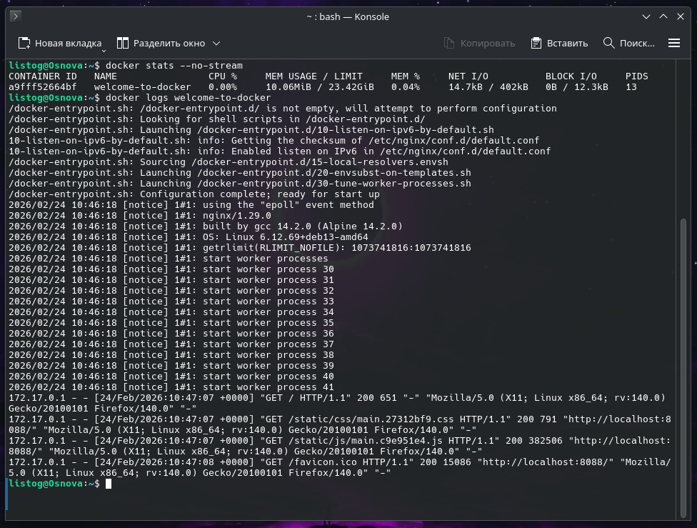
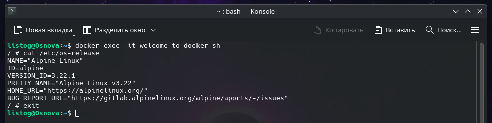

# Практическая работа: Основы Docker

## 1. Проверка версии Docker
Проверяем, что Docker установлен и работает:
```bash
docker version
```
> 

## 2. Подготовка окружения (чистый лист)
Очищаем систему от старых контейнеров и образов, чтобы избежать конфликтов портов и имен.

Остановить все запущенные контейнеры (если есть):
```bash
docker stop $(docker ps -q)
```
Удалить все остановленные контейнеры:
```bash
docker container prune -f
```
Удалить неиспользуемые образы:
```bash
docker image prune -a -f
```

## 3. Запуск образа Welcome to Docker
Скачиваем и запускаем готовый образ. Флаг `-d` запускает его в фоне, а `-p 8088:80` пробрасывает порт.
```bash
docker run -d -p 8088:80 --name welcome-to-docker docker/welcome-to-docker
```

Проверяем, что образ скачался, а контейнер успешно запущен:
```bash
docker images
docker ps
```
> 

## 4. Проверка работы веб-страницы (Результат)
Убедимся, что порт 8088 прослушивается в Debian:
```bash
ss -tuln | grep 8088
```

**Проверка в браузере:**
Открываем браузер и переходим по адресу: `http://localhost:8088` (или `http://127.0.0.1:8088`).

> 

## 5. Управление и мониторинг контейнера
Посмотрим потребление ресурсов контейнером (ключ `--no-stream` выведет один раз и завершит команду, чтобы не висеть в консоли):
```bash
docker stats --no-stream
```
Посмотрим логи веб-сервера внутри контейнера:
```bash
docker logs welcome-to-docker
```
> 

## 6. Работа внутри контейнера
Зайдем внутрь работающего контейнера в интерактивном режиме:
```bash
docker exec -it welcome-to-docker sh
```
Посмотрим информацию об операционной системе внутри контейнера:
```bash
cat /etc/os-release
```
Выйдем из контейнера обратно в наш Debian:
```bash
exit
```
> 

## 7. Финальная очистка системы
Убираем за собой после завершения работы:

Останавливаем наш контейнер:
```bash
docker stop welcome-to-docker
```
Удаляем контейнер:
```bash
docker rm welcome-to-docker
```
Удаляем образ:
```bash
docker rmi docker/welcome-to-docker
```
