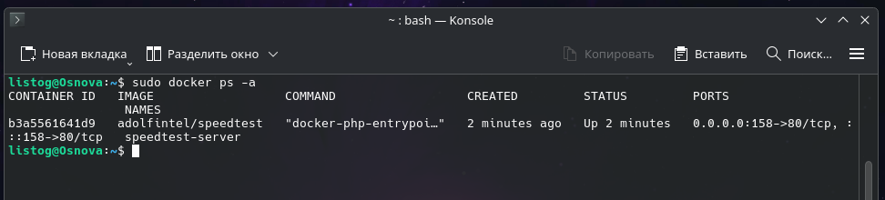
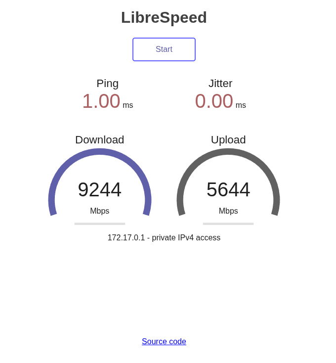

# Развертывание локального сервера Speedtest через Docker

Данное руководство описывает процесс запуска собственного сервера для проверки скорости интернет-соединения с помощью Docker.

> **Важные правила и замечания:**
> * Тест скорости интернета в РФ может работать нестабильно или быть недоступен из-за блокировок РКН.
> * Никогда в разработке не используйте русские имена файлов и каталогов!
> * Никогда в разработке не используйте пробелы и спецсимволы в именах файлов и каталогов!

## 1. Запуск контейнера
Для развертывания сервера мы будем использовать готовый образ `adolfintel/speedtest`. Чтобы загрузить и запустить контейнер, выполните следующую команду в терминале:

    sudo docker run -d -p 158:80 --name speedtest-server adolfintel/speedtest

**Расшифровка аргументов запуска:**
* -d — запуск контейнера в фоновом режиме, отсоединенном от консоли.
* -p 158:80 — проброс порта хоста (158) на HTTP-порт веб-сервера внутри контейнера (80).
* --name speedtest-server — задает удобное и понятное имя для дальнейшего управления контейнером.

## 2. Проверка статуса работы
После выполнения команды убедитесь, что контейнер успешно запущен:

    sudo docker ps -a

В выведенной таблице должен отображаться контейнер `speedtest-server` со статусом `Up`.

## 3. Доступ к интерфейсу и тестирование
Откройте любой веб-браузер и перейдите по адресу:

    http://localhost:158/

На открывшейся странице интерфейса Speedtest вы сможете запустить тест и проверить задержку (Ping), а также скорость скачивания (Download) и загрузки (Upload).

## 4. Команды управления сервером
Для дальнейшего администрирования контейнера используйте следующие команды:

* Остановка сервера:
    sudo docker stop speedtest-server

* Повторный запуск:
    sudo docker start speedtest-server

* Полное удаление контейнера:
    sudo docker rm -f speedtest-server
