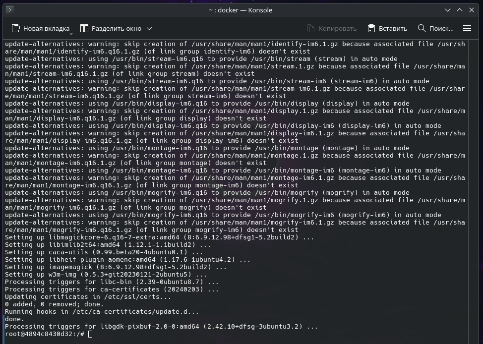
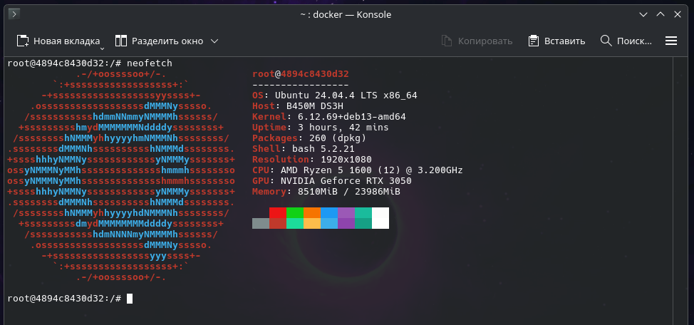

# Использование временного контейнера Ubuntu для тестирования команд

Данное руководство описывает процесс быстрого развертывания временной изолированной среды на базе ОС Ubuntu. Это отличный способ безопасно тестировать консольные команды, скрипты и устанавливать пакеты, не засоряя вашу основную операционную систему (Debian).

> **Важно:** Никогда в разработке не используйте русские имена файлов и каталогов!
> Никогда не используйте пробелы и спецсимволы в именах файлов и каталогов!

## 1. Запуск временного контейнера
Для загрузки официального образа Ubuntu и немедленного входа в его командную оболочку выполните следующую команду:

    docker run -it --rm ubuntu:latest /bin/bash

**Расшифровка аргументов запуска:**
* `-it` — связка из двух флагов (`-i` и `-t`), которая позволяет запустить контейнер в интерактивном режиме и привязать к нему ваш терминал (чтобы вы могли вводить команды).
* `--rm` — **ключевой флаг для этой задачи**. Он приказывает Docker автоматически удалить контейнер сразу после того, как вы из него выйдете.
* `ubuntu:latest` — указание использовать самую свежую версию официального образа Ubuntu.
* `/bin/bash` — команда, которая будет запущена внутри контейнера (в данном случае — запуск командного интерпретатора Bash).

### Возможные ошибки при загрузке
Если при выполнении команды вы получаете ошибку, связанную с тайм-аутом сети:

> `docker: Error response from daemon: Get "...": net/http: TLS handshake timeout`

**Решение:** Просто проигнорируйте её и запустите команду `docker run` повторно. Обычно это временный сетевой сбой при обращении к серверам Docker Hub.

## 2. Работа внутри контейнера и установка пакетов
После успешного запуска приглашение вашего терминала изменится (например, на `root@<id_контейнера>:/#`). Теперь вы находитесь внутри чистой Ubuntu! 

Давайте обновим списки пакетов и установим пару полезных утилит:

    apt update && apt install neofetch curl -y

После завершения установки вы можете протестировать их работу. 
Выведем красивую системную информацию об ОС внутри контейнера:

    neofetch

И проверим версию установленной утилиты `curl`:

    curl --version

## 3. Завершение работы и автоматическая очистка
Поскольку мы запустили контейнер с флагом `--rm`, вам не нужно беспокоиться об очистке системы. Чтобы завершить работу и вернуться в терминал вашего Debian, просто введите:

    exit

> **Внимание:** Как только вы нажмете Enter, контейнер будет остановлен и **мгновенно удален**. Все файлы, скачанные пакеты и изменения, которые вы сделали внутри (включая установленные `neofetch` и `curl`), исчезнут навсегда.
