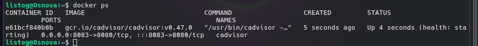
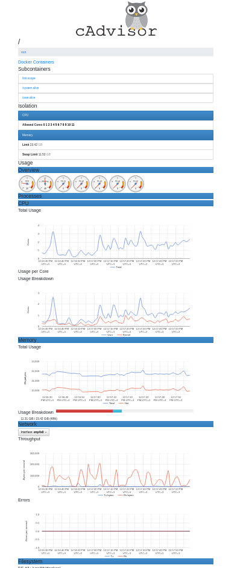

# Практическая работа: Мониторинг контейнеров с cAdvisor

Данная работа посвящена развертыванию инструмента cAdvisor (Container Advisor) для анализа производительности и мониторинга ресурсов Docker-контейнеров в реальном времени.

---

## 1. Подготовка и проверка портов
Перед запуском проверяем, свободен ли порт 8083, чтобы избежать конфликтов с другими сервисами.

Команда для проверки (Linux/WSL):
ss -tuln | grep 8083

*Если вывод пустой — порт готов к использованию.*

## 2. Запуск контейнера cAdvisor
Для работы мониторинга необходимо пробросить системные директории хоста внутрь контейнера. Мы используем флаг -v для монтирования в режиме "только чтение" (:ro).

Команда запуска:
docker run -d \
  --name=cadvisor \
  -p 8083:8080 \
  -v /:/rootfs:ro \
  -v /var/run:/var/run:ro \
  -v /sys:/sys:ro \
  -v /var/lib/docker/:/var/lib/docker:ro \
  --privileged \
  --device=/dev/kmsg \
  gcr.io/cadvisor/cadvisor:v0.47.0

## 3. Проверка статуса контейнера
Убедимся, что контейнер успешно запущен и отображается в списке активных процессов Docker.

docker ps

> 

## 4. Веб-интерфейс (Результат работы)
cAdvisor предоставляет графическую панель с метриками CPU, памяти и сетевой активности.

Проверка в браузере:
Перейдите по адресу http://localhost:8083

В интерфейсе можно увидеть как общую нагрузку на систему, так и детальные графики по каждому отдельному контейнеру в разделе "Docker Containers".

> 

## 5. Остановка и очистка системы
После завершения мониторинга удаляем контейнер и образ, чтобы освободить ресурсы.

# Остановить и удалить контейнер
docker stop cadvisor && docker rm cadvisor

# Удалить образ
docker rmi gcr.io/cadvisor/cadvisor:v0.47.0
